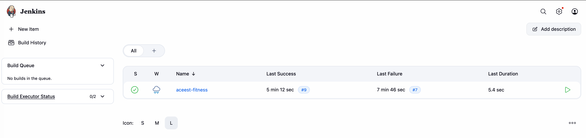
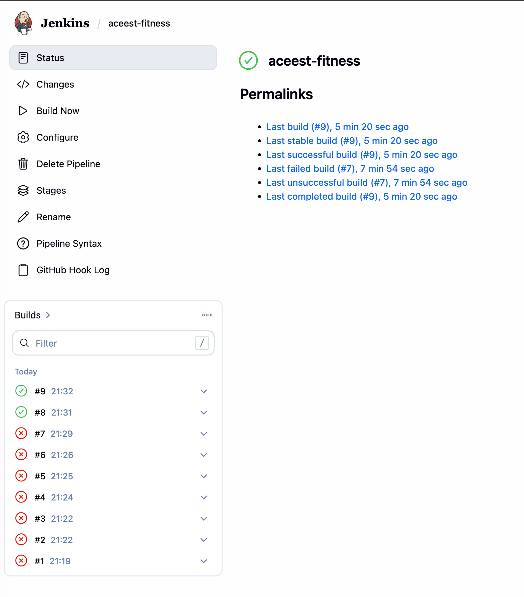
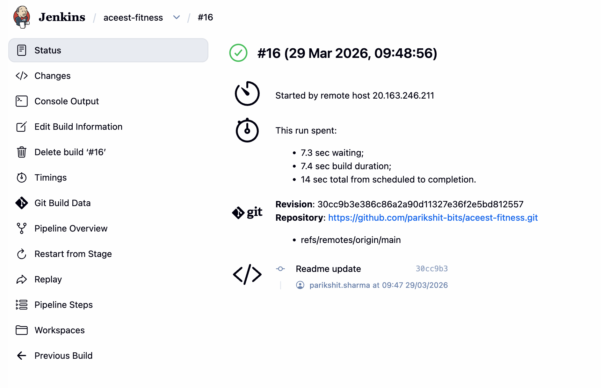
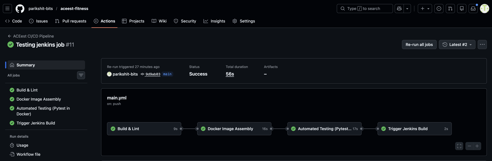

# ACEest Fitness & Gym — CI/CD Pipeline Project

A Flask-based REST API for fitness and gym client management, fully containerised with
Docker and integrated with a CI/CD pipeline via GitHub Actions and Jenkins.

---

## Project Structure

```text
aceest-fitness/
├── app.py                        # Flask application
├── test_app.py                   # Pytest test suite
├── requirements.txt              # Python dependencies
├── Dockerfile                    # Container definition
├── Jenkinsfile                   # Jenkins pipeline
└── .github/
    └── workflows/
        └── main.yml              # GitHub Actions CI/CD pipeline
```

---

## API Endpoints

| Method | Route                  | Description                     |
|--------|------------------------|---------------------------------|
| GET    | `/`                    | Health check                    |
| GET    | `/programs`            | List all available programs      |
| GET    | `/programs/<name>`     | Get details of a program         |
| GET    | `/clients`             | List all clients                 |
| POST   | `/clients`             | Add or update a client           |
| GET    | `/clients/<name>`      | Get a specific client            |
| DELETE | `/clients/<name>`      | Delete a client                  |
| POST   | `/calories`            | Calculate daily calorie target   |
| POST   | `/progress`            | Log weekly adherence             |
| GET    | `/progress/<name>`     | Get a client's progress history  |

---

## API cURL Examples

### Health Check
```bash
curl http://localhost:5000/
```

### Programs

```bash
# List all programs
curl http://localhost:5000/programs

# Get details of a specific program
curl http://localhost:5000/programs/Beginner%20(BG)

# Other valid program names (URL-encoded):
# Fat%20Loss%20(FL)%20-%203%20day
# Muscle%20Gain%20(MG)%20-%20PPL
```

### Clients

```bash
# Add / update a client
curl -X POST http://localhost:5000/clients \
  -H "Content-Type: application/json" \
  -d '{"name": "Arjun", "age": 28, "weight": 75.0, "program": "Beginner (BG)"}'

# Add a fat loss client
curl -X POST http://localhost:5000/clients \
  -H "Content-Type: application/json" \
  -d '{"name": "Priya", "age": 24, "weight": 60.0, "program": "Fat Loss (FL) - 3 day"}'

# Add a muscle gain client
curl -X POST http://localhost:5000/clients \
  -H "Content-Type: application/json" \
  -d '{"name": "Ravi", "age": 30, "weight": 85.0, "program": "Muscle Gain (MG) - PPL"}'

# List all clients
curl http://localhost:5000/clients

# Get a specific client
curl http://localhost:5000/clients/Arjun

# Delete a client
curl -X DELETE http://localhost:5000/clients/Arjun
```

### Calorie Calculator

```bash
# Calculate calories for fat loss
curl -X POST http://localhost:5000/calories \
  -H "Content-Type: application/json" \
  -d '{"weight": 70.0, "program": "Fat Loss (FL) - 3 day"}'

# Calculate calories for muscle gain
curl -X POST http://localhost:5000/calories \
  -H "Content-Type: application/json" \
  -d '{"weight": 80.0, "program": "Muscle Gain (MG) - PPL"}'

# Calculate calories for beginner
curl -X POST http://localhost:5000/calories \
  -H "Content-Type: application/json" \
  -d '{"weight": 65.0, "program": "Beginner (BG)"}'
```

### Progress Tracking

```bash
# Log weekly adherence for a client
curl -X POST http://localhost:5000/progress \
  -H "Content-Type: application/json" \
  -d '{"client_name": "Arjun", "week": "Week 01", "adherence": 85}'

# Log another week
curl -X POST http://localhost:5000/progress \
  -H "Content-Type: application/json" \
  -d '{"client_name": "Arjun", "week": "Week 02", "adherence": 90}'

# Get all progress entries for a client
curl http://localhost:5000/progress/Arjun
```

---

## Local Setup & Execution

### Prerequisites
- Python 3.11+
- Docker Desktop

### Run locally (without Docker)
```bash
# 1. Clone the repository
git clone https://github.com/<your-username>/aceest-fitness.git
cd aceest-fitness

# 2. Install dependencies
pip3 install -r requirements.txt

# 3. Start the Flask server
python3 app.py
# API available at http://localhost:5000
```

### Run with Docker
```bash
# Build the image
docker build -t aceest-fitness .

# Run the container
docker run -p 5000:5000 aceest-fitness

# API available at http://localhost:5000
```

---

## Running Tests Manually

```bash
# Without Docker
pytest test_app.py -v

# Inside Docker
docker run --rm aceest-fitness python -m pytest test_app.py -v --tb=short
```

---

## GitHub Actions — CI/CD Pipeline

The pipeline is defined in `.github/workflows/main.yml` and is triggered automatically
on every **push** or **pull request** to the `main` or `develop` branch.

### Pipeline Stages

| Stage | Description |
|-------|-------------|
| **Build & Lint** | Installs Python dependencies and runs `flake8` to catch syntax errors and style violations |
| **Docker Image Assembly** | Builds the Docker image and verifies it was created successfully. Runs only after lint passes |
| **Automated Testing (Pytest in Docker)** | Rebuilds the image and runs the full Pytest suite inside the container. Runs only after Docker build passes |
| **Trigger Jenkins Build** | Fires the Jenkins pipeline via its remote API. Runs **only on pushes to `main`**, after all 3 jobs above pass |

Each stage is a dependency of the next — a failure in any stage halts the entire pipeline.

### How the Jenkins Trigger Works

Instead of relying on a GitHub webhook, the pipeline uses GitHub Actions Job 4 to
actively call the Jenkins Remote Build API via `curl` after all tests pass. This means
Jenkins is only triggered when the code is verified and healthy.

```
push to main
    └── Build & Lint ✅
            └── Docker Image Assembly ✅
                    └── Automated Testing ✅
                                └── Trigger Jenkins Build 🚀
```

---

## Setting Up GitHub Actions Secrets

The Jenkins trigger step requires 4 secrets to be configured in GitHub. These are
encrypted and never exposed in logs or the workflow file.

### Step 1: Generate a Jenkins API Token

1. Open Jenkins at `http://localhost:8080`
2. Click on your username (top right) → **Security**
3. Scroll to **API Token** → click **Add new Token**
4. Give it a name (e.g. `github-actions`) → click **Generate**
5. **Copy the token immediately** — Jenkins will never show it again

### Step 2: Add Secrets to GitHub

Go to your repo → **Settings → Secrets and variables → Actions → New repository secret**
and add each of the following:

| Secret Name | Value | Description |
|-------------|-------|-------------|
| `JENKINS_URL` | `https://<your-ngrok-url>.ngrok-free.dev` | Base ngrok URL (no trailing slash, no path) |
| `JENKINS_JOB_NAME` | `aceest-fitness` | Exact job name as shown in Jenkins |
| `JENKINS_USER` | `admin` | Your Jenkins username |
| `JENKINS_API_TOKEN` | `<token from Step 1>` | Jenkins API token (not your password) |

> **Important:** Secret names must match exactly — no spaces, no extra characters.

### Step 3: Enable Remote Build Trigger in Jenkins

1. Go to `http://localhost:8080/job/aceest-fitness/configure`
2. Scroll to **Build Triggers**
3. Check **"Trigger builds remotely (e.g., from scripts)"**
4. Set the **Authentication Token** to the same value as your `JENKINS_API_TOKEN` secret
5. Click **Save**

---

## Jenkins Local Setup

### Step 1: Run Jenkins in Docker

```bash
docker run -d --name jenkins \
  -p 8080:8080 -p 50000:50000 \
  -v jenkins_home:/var/jenkins_home \
  -v /var/run/docker.sock:/var/run/docker.sock \
  jenkins/jenkins:lts
```

> Using `--name jenkins` gives the container a fixed name so you can always reference
> it by name instead of a random container ID.

Open `http://localhost:8080` in your browser.

### Step 2: Unlock Jenkins

Get the initial admin password:

```bash
docker exec jenkins cat /var/jenkins_home/secrets/initialAdminPassword
```

Paste it in the browser → click **Install suggested plugins** → create your admin user.

### Step 3: Install Python, pip and Docker CLI inside Jenkins container

Jenkins runs inside its own container and does not have Python or Docker by default.
Run these commands to install them (replace `<container_id>` with your actual ID from `docker ps`):

```bash
# Install Python and pip
docker exec -u root <container_id> apt-get update
docker exec -u root <container_id> apt-get install -y python3 python3-pip docker.io

# Create symlinks so `pip` and `python` commands work
docker exec -u root <container_id> ln -s /usr/bin/python3 /usr/bin/python
docker exec -u root <container_id> ln -s /usr/bin/pip3 /usr/bin/pip

# Allow Jenkins to run Docker commands
docker exec -u root <container_id> chmod 666 /var/run/docker.sock

# Verify
docker exec <container_id> pip --version
docker exec <container_id> docker --version
```

Then restart Jenkins so the changes take effect:

```bash
docker restart <container_id>
```

> **Note:** pip installs packages to `/var/jenkins_home/.local/bin/` which is not on
> PATH by default. The Jenkinsfile uses the full path
> `/var/jenkins_home/.local/bin/flake8` to call flake8 directly.

### Step 4: Create the Pipeline job in Jenkins

1. Click **New Item**
2. Enter name `aceest-fitness` → select **Pipeline** → click **OK**
3. Under **Build Triggers** → check **"Trigger builds remotely (e.g., from scripts)"**
4. Set the **Authentication Token** to match your `JENKINS_API_TOKEN` GitHub secret
5. Scroll to **Pipeline** section
6. Set **Definition** → `Pipeline script from SCM`
7. Set **SCM** → `Git`
8. Enter your repo URL → `https://github.com/<your-username>/aceest-fitness.git`
9. Set **Branch** to `*/main`
10. Set **Script Path** → `Jenkinsfile`
11. Click **Save**

### Step 5: Expose Jenkins via ngrok

Jenkins runs on localhost and is not reachable by GitHub Actions by default.
ngrok creates a public tunnel to your local machine.

```bash
# Install ngrok
brew install ngrok

# In a new terminal, expose Jenkins port
ngrok http 8080
```

Copy the `https://` URL ngrok gives you, e.g.:
```
https://munificent-amelie-surroundedly.ngrok-free.dev
```

Update your `JENKINS_URL` GitHub secret with this URL whenever it changes.

> **Note:** On the ngrok free tier, the URL changes every time you restart ngrok.
> Keep the ngrok terminal open while running your pipeline.
> ngrok's free tier also provides one static domain — use that to avoid updating
> the secret each time.

### Step 6: Trigger the pipeline

Make any commit and push to `main`:

```bash
git add .
git commit -m "ci: trigger pipeline"
git push origin main
```

GitHub Actions will run all 4 jobs automatically. Once the first 3 pass, Jenkins will
be triggered via the remote API. Go to `http://localhost:8080` → click your job →
watch the build run live.

### Expected successful output

**GitHub Actions:**
```
Build & Lint              ✅  ~9s
Docker Image Assembly     ✅  ~16s
Automated Testing         ✅  ~17s
Trigger Jenkins Build     ✅  ~2s
```

**Jenkins:**
```
Stage: Checkout           ✅
Stage: Build Environment  ✅
Stage: Lint               ✅
Stage: Unit Tests         ✅
Stage: Docker Build       ✅
Stage: Quality Gate       ✅
Finished: SUCCESS
```

---

## Jenkins BUILD Integration

The `Jenkinsfile` defines a declarative pipeline with six stages:

1. **Checkout** — Pulls latest source code from the connected GitHub repository.
2. **Build Environment** — Installs Python dependencies via `pip`.
3. **Lint** — Runs `flake8` as a quality gate for code style.
4. **Unit Tests** — Executes `pytest` directly on the host build agent.
5. **Docker Build** — Builds the Docker image tagged with the Jenkins build number.
6. **Quality Gate** — Runs the full Pytest suite inside the freshly built container as
   a final integration check.

The `post` block cleans up the Docker image after every run and logs overall pass/fail status.

---

## Git Branching Strategy

| Branch     | Purpose                              |
|------------|--------------------------------------|
| `main`     | Production-ready, protected branch   |
| `develop`  | Integration branch for features      |
| `feature/` | Individual feature branches          |
| `fix/`     | Bug fix branches                     |

Commit message format: `<type>(<scope>): <short description>`
Example: `feat(clients): add DELETE endpoint for client removal`

---

## Pipeline Screenshots




## GitHub Actions Screenshots
